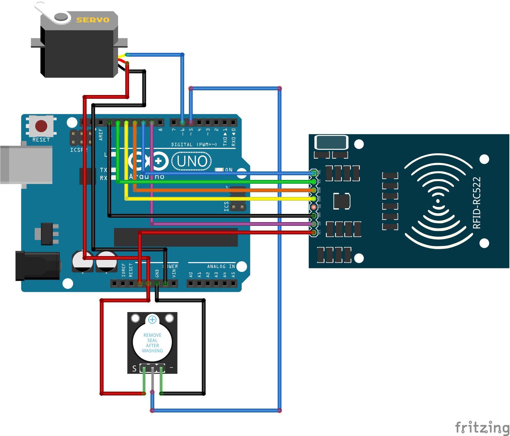
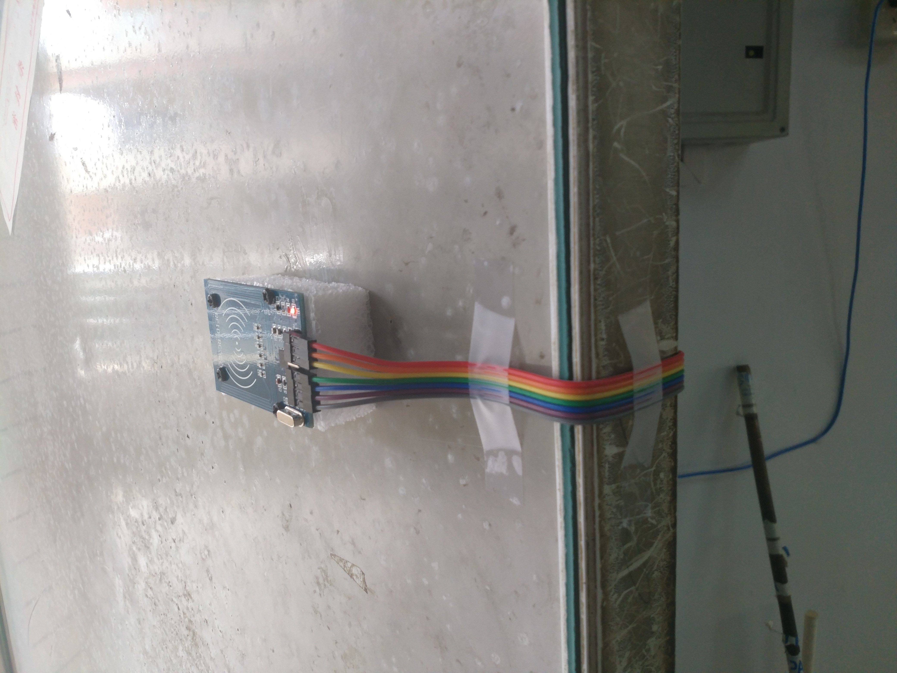
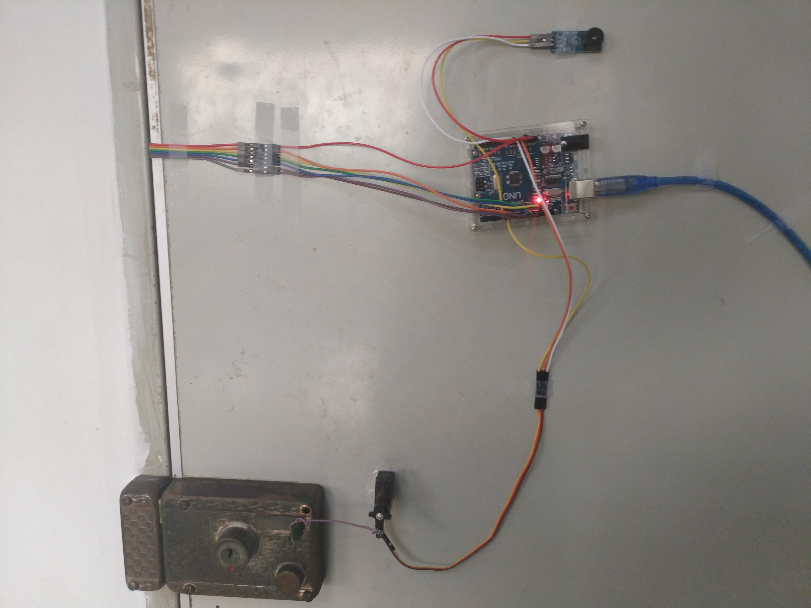
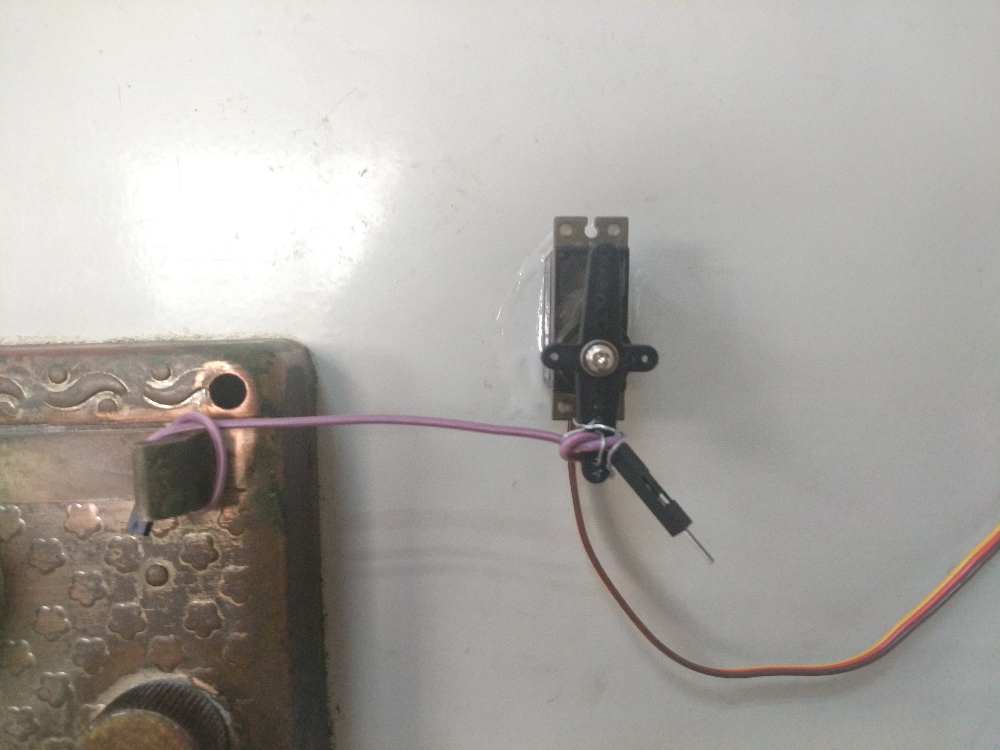

# Authority-Management

使用 Arduino UNO R3 制作简易门禁系统。

你需要：

1. Arduino UNO R3（CH340G）
2. 拉力足够的舵机（MG90S）
3. NFC 读卡器（MFRC522）
4. （可选）蜂鸣器（KY012）

连线如下图所示。

代码需安装库 `MFRC522 == 1.4.4` 才可编译。

将 MG90S 用胶水固定到门上，用线拉住门闩，再将 MFRC522 放到门外即可使用。

注意 MFRC522 不可贴着金属（如铁门）使用，否则会失灵。同时为了防止被人拔线，代码里每隔 `20s` 会重置 MFRC522 。

